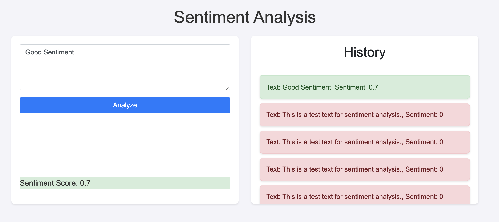
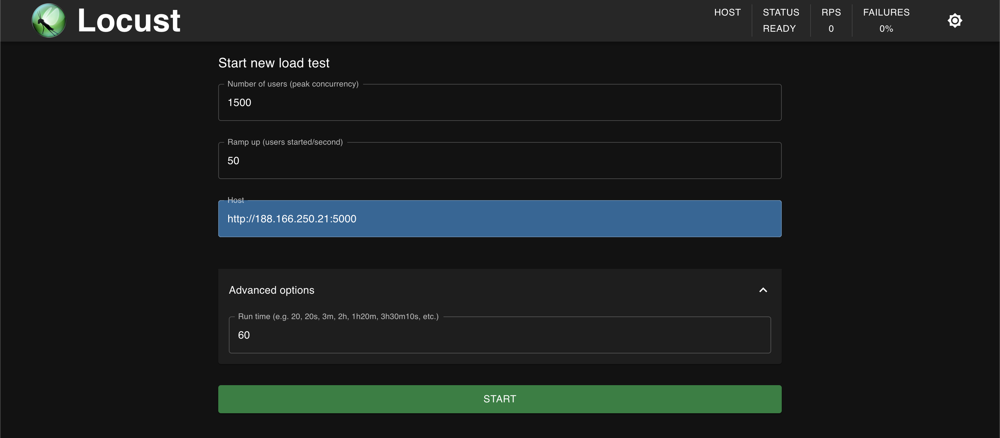
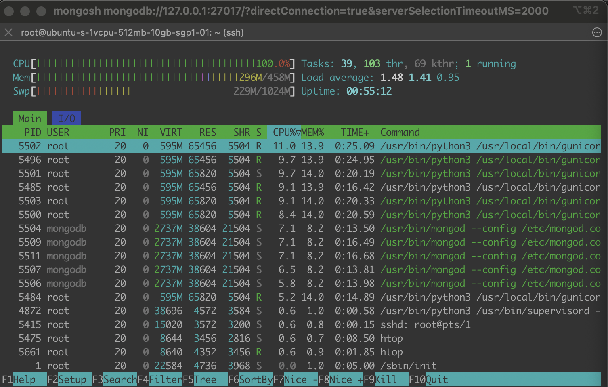
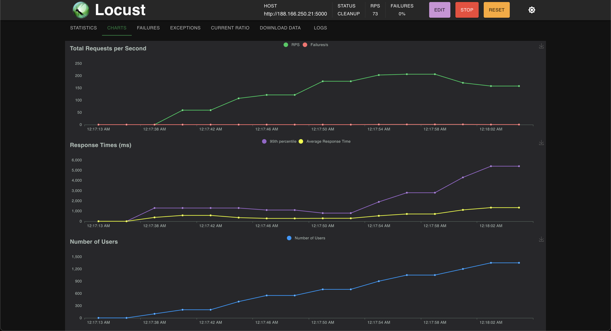
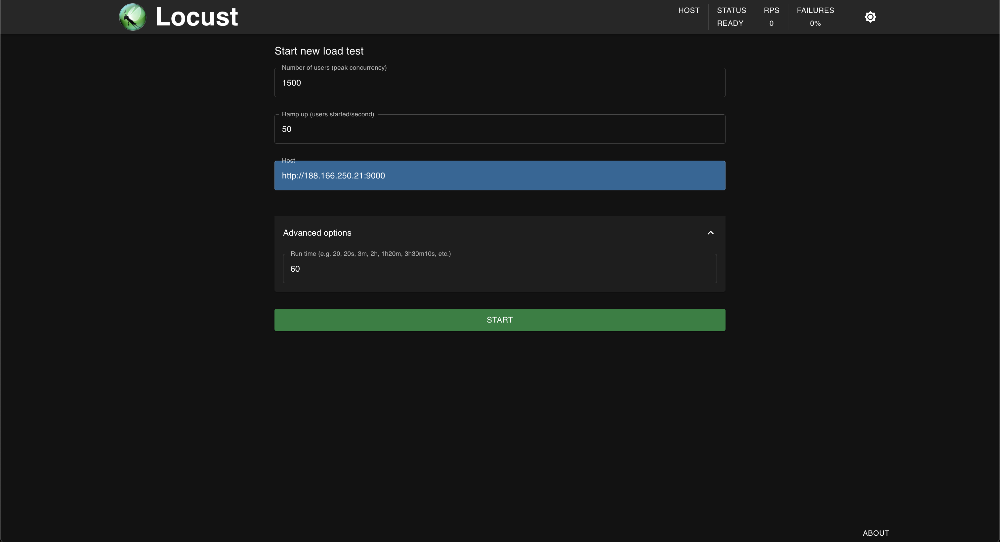
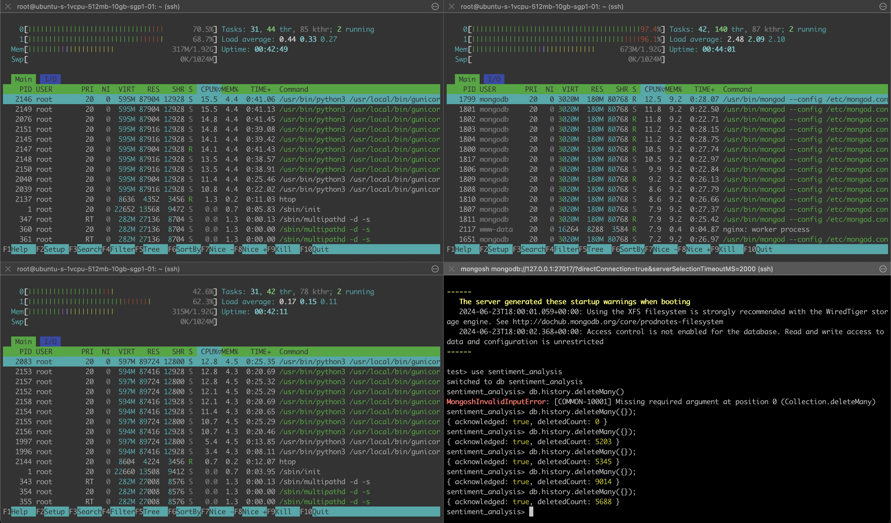
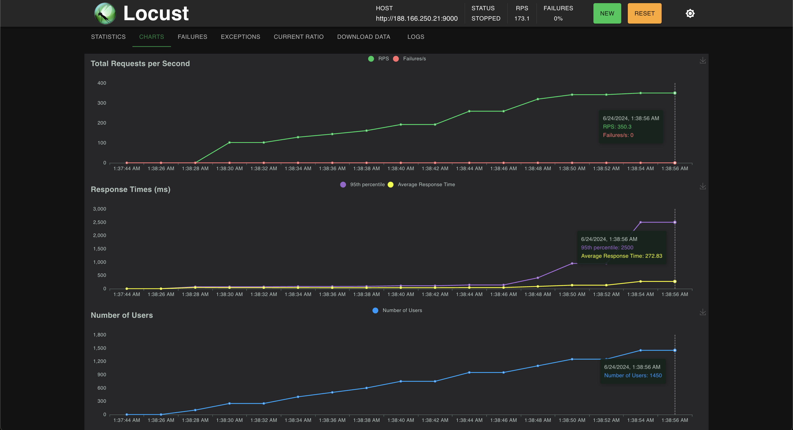

# 🔥 FINAL PROJECT TEKNOLOGI KOMPUTASI AWAN 2024🔥

## A. Cakupan Capaian Pembelajaran Mata Kuliah (CPMK)
1. Mampu memahami dan menerapkan berbagai servis pada layanan awan.
2. Mampu merancang dan mengaplikasikan teknologi komputasi awan.


## B. Constraint Final Project
1. FP ini dikerjakan secara berkelompok **maksimal 4-5 orang**
2. Linkungan cloud yang digunakan (pilih salah satu)
    - `Google Cloud Platform (Credit 300$)`
        * Boleh memanfaatkan semua fitur yang ada
        * Harga sesuai dengan yang disediakan Provider
    - `Digital Ocean (Credit 200$)`
        * Boleh memanfaatkan semua fitur yang ada
        * Harga sesuai dengan yang disediakan Provider
    - `Microsoft Azure (Credit 100$)`
        * Boleh memanfaatkan semua fitur yang ada
        * Harga sesuai dengan pricing calculator Azure
    - `Local Vritual Machine (VirtualBox/Vagrant) sebagai alternatif simulasi cloud.`
        * Apabila membuat lebih dari 1 VM, maka VM harus dibuat **minimal** dari 2 Komputer / Host yang berbeda
        * Hanya boleh membuat VM dengan spesifikasi sebagai berikut

            | No | Tipe   | CPU   | Memory | Harga / bulan |
            |----|--------|-------|--------|---------------|
            | 1  | vm1    | 1vCPU | 512 MB | 4 US$         |
            | 2  | vm2    | 1vCPU | 1 GB   | 6 US$         |
            | 3  | vm3    | 1vCPU | 2 GB   | 12 US$        |
            | 4  | vm4    | 2vCPU | 2 GB   | 18 US$        |
            | 5  | vm5    | 2vCPU | 4 GB   | 24 US$        |
            | 6  | vm6    | 4vCPU | 8 GB   | 48 US$        |


## C. Permasalahan

Anda adalah seorang lulusan Teknologi Informasi, sebagai ahli IT, salah satu kemampuan yang harus dimiliki adalah **Keampuan merancang, membangun, mengelola aplikasi berbasis komputer menggunakan layanan awan untuk memenuhi kebutuhan organisasi.**

Pada suatu saat anda mendapatkan project untuk mendeploy sebuah aplikasi Sentiment Analysis dengan komponen Backend menggunakan python: [sentiment-analysis.py](/Resources/BE/sentiment-analysis.py) dengan spesifikasi sebagai berikut

## Endpoints:


1. **Analyze Text**
   - **Endpoint:** `POST /analyze`
   - **Description:** This endpoint accepts a text input and returns the sentiment score of the text.
   - **Request:**
     ```json
     {
        "text": "Your text here"
     }
     ```
    - **Response:**
      ```json
      {
        "sentiment": <sentiment_score>
      }
      ```

2. **Retrieve History**
   - **Endpoint:** `GET /history`
   - **Description:** This endpoint retrieves the history of previously analyzed texts along with their sentiment scores.
   - **Response:**
     ```json
     {
      {
        "text": "Your previous text here",
        "sentiment": <sentiment_score>
      },
      ...
     }
     ```
---

Kemudian juga disediakan sebuah Frontend sederhana menggunakan [index.html](/Resources/FE/index.html) dan [styles.css](/Resources/FE/styles.css) dengan tampilan antarmuka sebagai berikut



Kemudian anda diminta untuk mendesain arsitektur cloud yang sesuai dengan kebutuhan aplikasi tersebut. Apabila dana maksimal yang diberikan adalah **1 juta rupiah per bulan (65 US$)**
konfigurasi cloud terbaik seperti apa yang bisa dibuat?

## D. Output Final Project dan Penilaian
1. Buatlah rancangan arsitektur cloud nya beserta harga yang diperlukan (20%) **(dipresentasikan saat diskusi minggu 15)**
2. Lakukan instalasi / implementasi rancangan cloud dan aplikasi, pastikan setiap endpoint aplikasi dapat berjalan (20%)
3. Lakukan load testing menggunakan Locust ([Locustfile](/Resources/Test/locustfile.py)) untuk endpoint Get History dan Analyze dengan parameter pengujian sebagai berikut (35%)
    1. Locust harus dijalankan dengan Komputer / Host yang berbeda dari Aplikasi
    2. Berapakah **jumlah Request per seconds (RPS)** maksimum yang dapat ditangani oleh server dengan durasi waktu load testing 60 detik? (tingkat failure harus 0%)
    3. Berapa **jumlah peak concurrency** maksimum yang dapat ditangani oleh server dengan **spawn rate 50** dan durasi waktu load testing 60 detik? (tingkat failure harus 0%)
    4. Berapa **jumlah peak concurrency** maksimum yang dapat ditangani oleh server dengan **spawn rate 100** dan durasi waktu load testing 60 detik? (tingkat failure harus 0%)
    5. Berapa **jumlah peak concurrency** maksimum yang dapat ditangani oleh server dengan **spawn rate 200** dan durasi waktu load testing 60 detik? (tingkat failure harus 0%)
    6. Berapa **jumlah peak concurrency** maksimum yang dapat ditangani oleh server dengan **spawn rate 500** dan durasi waktu load testing 60 detik? (tingkat failure harus 0%)
4. Buatlah dokumentasi laporan dalam github (markdown) dengan konten sebagai berikut: (25%)
    1. Introduction, jelaskan permasalahan (bisa mereferensi ke soal ini)
    2. Gambar desain rancangan arsitektur komputasi awan (dapat menggunakan https://app.diagrams.net/) dan Tabel harga spesifikasi dan Harga VM
    3. Tuliskan langkah langkah implementasi dan konfigurasi teknologinya (Load balancing, instalasi app.py, instalasi mongodb, dll) disertai screenshot lebih bagus 
    4. Hasil Pengujian endpoint setiap API (dapat menggunakan Postman) dan tampilan Antarmuka Aplikasi
    5. Hasil Pengujian dan analisis Loadtesting menggunakan Locust 
    6. Kesimpulan dan saran.

## X. Tips and trick
1. Implementasikan dengan spesifikasi paling kecil terlebih dahulu, coba cari kofigurasi optimal untuk memaksimalkan kerja processor dan memory, kemudian lakukan scale out untuk mendapatkan hasil Load testing terbaik.
2. Manfaatkan semua yang sudah dipelajari dalam kelas dan praktikum komputasi awan (Load balancing, provisioning, dll)
3. Hapus isi database setiap kali akan melakukan pengujian menggunakan locust
4. Gunakan kreativitas dalam eksperimen, berpikir out of the box


## Z. Teknis Revisi dan Penilaian

### Teknis Revisi
1. Mengisi form di google drive link berikut [Revisi minggu 17](https://its.id/DemoCloud2024)
2. Update Laporan dalam github markdown
    - Update hasil revisi dalam laporan
    - tambahkan link **Video untuk demo dalam laporan sebagai pengganti demo langsung.** konten video meliputi:
      - Penjelasan singkat arsitektur yang dibuat
      - Demo pengujian aplikasi sentiment analysis
      - Demo dalam menjalankan locust dan menampilkan hasil output dari locust
3. Waktu terakhir untuk revisi adalah 29 Juni 2024, apabila melebihi batas waktu yang ditentukan, maka akan diambil nilai terakhir sebelum revisi.
4. Hasil nilai Final akan diumumkan pada hari Senin 1 Juli 2024 pada link [ini](https://its.id/DemoCloud2024)

### Teknis Penilaian
1. penilaian berdasarkan hasil laporan dari github markdown
    - Terdapat rancangan arsitektur (20 poin) (dokumentasi laporan 5 poin)
      - gambar arsitektur (maks 10 poin)
      - rancangan harga (maks 10 poin)
    - Terdapat implementasi arsitektur dan pengujian aplikasi (20 poin) + (dokomentasi laporan 5 poin)
      - teknis implementasi jelas apa saja langkah langkah yang dilakukan (maks 10 poin) dan didokumentasikan dengan detail (maks 5 poin)
      - setiap endpoint dapat diakses (maks 10 poin) dan didokumentasikan dengan detail (maks 5 poin)
    - Terdapat hasil pengujian menggunakan Locust (35 poin) (dokomentasi laporan 5 poin)
      - mencari maksimum nilai **RATA RATA RPS** yang didapat
        nilai (maksimum 30 poin): Rata rata RPS / 200 x 25 

        CONTOH : <br>

        berikut menggunakan single server droplet Digital Ocean (4$) dengan konfigurasi locust sebagai berikut
        
        

        resource utilization
        

        output 
        
        dari hasil tersebut didapatkan Rata rata RPS dengan failure 0% adalah 73 RPS, maka nilainya 73 / 200 x 30 = 10.95 poin

        CONTOH LAIN : <br>

        berikut menggunakan droplet 3 Digital Ocean (3x18$) dengan weighted load balancing
        

        resource utilization dengan 3 server
        

        output 
        

        dari hasil tersebut didapatkan Rata rata RPS dengan failure 0% adalah 73 RPS, maka nilainya 173 / 200 x 30 = 25.95 poin
        
      - Mencari user peak concurrency dengan spawn rate 50 100 200 dan 500 (maks 5 poin)

  - Terdapat Kesimpulan dan saran (10 poin)
    kesimpulan dari FP yang dikerjakkan dengan analisis mendalam. (maks 5 poin)
    saran ketika di masa mendatang jika mendapat project serupa dalam dunia nyata (maks 5 poin)

## BONUS
  Kelompok dengan nilai Final Project tertingi akan mendapatkan 🔥**Uang Cash senilai RP 100.000,00**🔥 (apabila terdapat lebih dari 1 tim dengan nilai tertinggi yang sama, akan diambil yang lebih dulu submit) 

## Special Notes
  Nilai dianggap sama untuk semua anggota tim, kecuali ada laporan dari anggota tim yang merasa ada anggota lainnya yang tidak ikut bekerja.

  Segala betuk kecurangan akan berdampak pada pengurangan nilai, kerjakan dengan jujur.

  **JANGAN LUPA DESTROY RESOURCES PROJECT KETIKA FP TELAH BERAKHIR.** 
